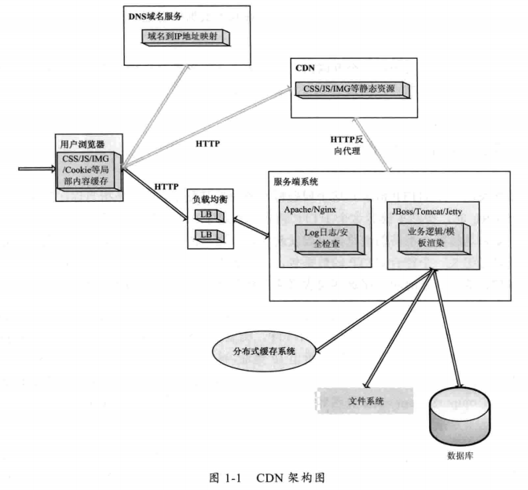

# B/S架构
## B/S架构的优势  
* 客户端（Browser）具有统一性，不需要特殊的配置和网络连接，有效的屏蔽了不同服务提供商给用户使用服务的差异性    
* 服务端（Server）基于统一的HTTP，和C/S框架使用自定义应用层协议不同，B/S架构使用统一的HTTP协议。使用统一的HTTP为服务提供商简化了开发模式，服务器开发者可以采用相对规范的开发模式，节约了开发成本   
## B/S网络架构的概述
B/S基于应用层协议HTTP来交换数据，和C/S应用采用的长链接交互模式不同，HTTP采用
无状态短链接的通信方式（通常一次请求完成一次数据交互，通常对应一个业务逻辑，然后通信断开链接）。  
> 目的：能够同时服务更多的用户，不可能每个用户访问一次后就一直保持这个链接  

> 既要满足用户的访问请求，又要保持用户请求的快速响应
  

> 当用户在Browser中输入一个URL时。  
第一步：会请求DNS把这个域名解析成对应的IP  
第二步：根据IP在互联网找到对应服务器   
第三步：向服务器发起一个get请求   
第四步：服务器决定返回默认的数据资源给访问的用户   
服务器：
服务器可能有很多台，到底指定那台服务器处理请求，需要一个负载均衡设备来平均分配所有用户的请求  
请求的数据储存在分布式缓存里，静态文件，数据库里  
数据返回浏览器时，浏览器解析数据发现还有一些静态资源（CSS，JS，图片），又会发起另外的HTTP请求，这些请求可能会在CDN上，CDN服务器会处理这个用户的请求   

> 网络架构的原则：  
互联网上所有的资源都要用一个URL（统一资源定位符）表示；想要服务和资源放到互联网上被访问到，需要独一无二的URL（互联网框架的精髓）　　
必须基于HTTP和服务器进行交互　　
数据展示必须在Browser中进行，只有Browser才能恢复它的容貌　　
## 如何发起一个请求  
1. 当输入一个URL按回车键就发起一个HTTP请求  
2. 发起一个HTTP请求和如何建立一个Socket链接的区别不大  
    >outputStream.write写的二进制格式要符合HTTP,浏览器在建立Socket链接之前，必须根据地址栏里输入URL的域名DNS解析成IP地址，再根据IP地址和默认80端口与远程服务器建立Socket链接，然后浏览器根据这个URL组装成一个get类型的HTTP请求头，通过outputStream.write发送到目标服务器，服务器等待inputStream.read返回数据，最后断开链接  
    总之发送一个HTTP请求的过程就是建立一个Socket通信的过程  
3. HTTP链接的本质就是建立一个Socket链接，就完全可以模拟浏览器发起HTTP请求。  
    > HttpClient是一个开源的处理HTTP请求的工具包  
    HttpClient调用实例：
      
        HttpClient httpClient = createHttpClient();
            PostMethod postMethod;
            String domainName=Switcher.domian;
            postMethod=new PostMethod(domainName);
            postMethod.addRequestHeader("Content-Type","application/x-www-form-urlencoded;charset=GBK");
            for (FilterData filterData:filterDatas){
                postMethod.addParameter("ip",filterData.ip);
                postMethod.addParameter("count",String.valueOf(filterData.count));
            }
            try{
            httpClient.executeMethod(postMethod);
                postMethod.getResponseBodyAsString();
            }catch (Exception e){
                logger.error(e);
            }