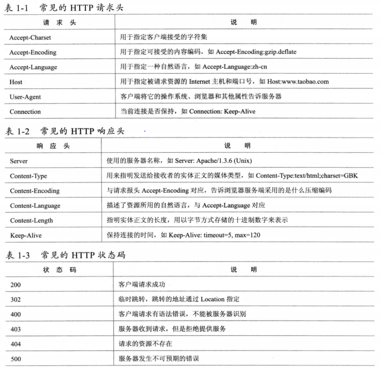
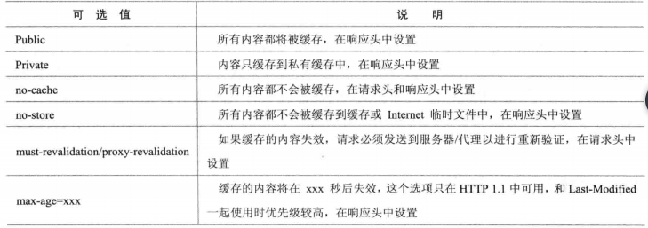

### HTTP解析  
> B/S网络架构的核心是HTTP 

理解HTTP最重要的是熟悉HTTP中的HTTP Header,HTTP Header控制这用户的数据传输。最关键的是控制着用户浏览器的渲染行为和服务器的执行逻辑
  

> 浏览器的缓存机制  

页面出现异常，考虑刷新浏览器缓存
Ctrl+F5:从新请求最新的页面，  
1. 此时浏览器会直接向目标URL发送请求，不会使用浏览器缓存的数据  
2. 即使请求发送到了服务器，也有可能访问的是缓存数据，比如应用服务器前端部署的一个缓存服务器
3. 通过HTTP控制：Ctrl+F5刷新页面时，HTTP请求头中会增加一些信息，告诉服务器我们获取的是最新数据不是缓存

> HTTP请求头的字段  

1. Cache-Control/Pragma  
这个字段指定所有缓存机制在整个请求/响应链中必须服从的命令。知道页面是否为缓存。不仅可以控制浏览器，还可以控制和HTTP相关的缓存或代理服务器  
  
Cache-Control请求字段支持最好，优先级比较高，和Expires同时出现时，Cache-Control覆盖其它字段   
Pragma字段作用和Cache-Control有点类似，是HTTP头中包含的一个特殊指令，使相关服务器遵守指令，最常见的Pragma：no-cache和Cache-Control:no-cache作用一样  
2. Expires   
Expires格式：Expires：sat,25 Fed 2012 12:22:17 GMT，超过这个时间值后，缓存将会失效，再浏览器发送请求之前检查这个页面的这个字段，看页面是否过期，过期就会重新向服务器发送请求  
3. Last-Modified/Etag  
Last-Modified字段一般用于表示服务器上资源最后的修改时间，资源是静态（自动加上Last-Modified）或动态（Servlet提供一个getLastModified方法用于检查某个动态内容是否已经更新），通过最后修改时间可以判断当前请求资源是否最新  
一般服务器在响应头中返回一个Last-Modified字段，告诉浏览器这个页面最后修改时间，格式：Last-Modified：Sat，25 Fed 2012 12：55：04 GMT，浏览器再次请求时会在请求头中增加一个If-Modified-Since:Sat,25 Fed 2012 12:55:04 GMT字段，询问当前缓存页面是否最新，如果最新返回304，告诉浏览器是最新的，服务器不会传输新数据  
Etag字段和Last-Modified字段有类似功能，这个字段让服务器给每个页面分配一个唯一编号，通过编号区分当前页面是否最新。  
Etag比Last-Modified更灵活，在后端的服务器有多台时难处理，每个服务器都要记住网站的所有资源，否则浏览器返回的编码没有意义
            

